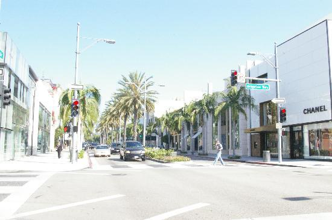
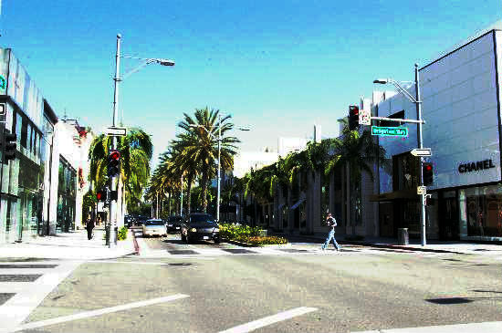

# image-toolbox-rs
Image Tool Box Written in Rust based on Piston/Image

[](https://travis-ci.com/Isan-Rivkin/image-toolbox-rs)


Quick to start, different and random Image operations.
WIP, many more features to be added. 

**Feel free to contribute and add new features via a Pull Request.**

# How to use

In Cargo.toml 
```rust
[dependencies]
image-toolbox = "*"
```

# The histogram struct 

```rust
use image_toolbox::{Histogram, load_img};
use image::{DynamicImage};
 
// load img 
let img = load_img("./test/bright_miami.jpg").unwrap();
let histogram = Histogram::new(&img);
println!("{:?}",histogram);
// get the r,g,b probability of some pixel value 
let (p_r,p_g,p_b) : (f32,f32,f32) = histogram.probability(200);
```
# turn a TOO bright image into normal colors

```rust
use image_toolbox::{load_img,normalize_brightness,save_img};
 
let img = load_img("./test/bright_miami.jpg").unwrap();
let new_image = normalize_brightness(&img).unwrap();
save_img(&img,"./test/result.jpg").unwrap();
```

## before 



## after

